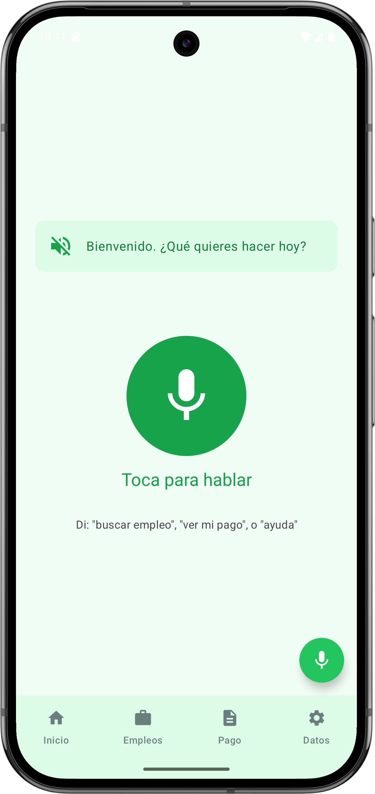
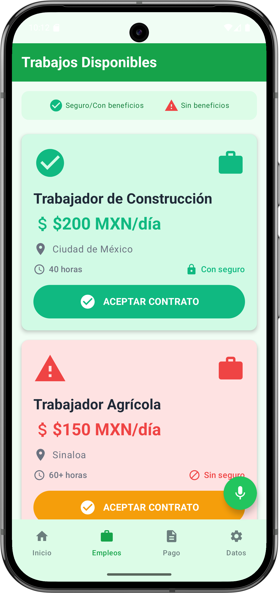
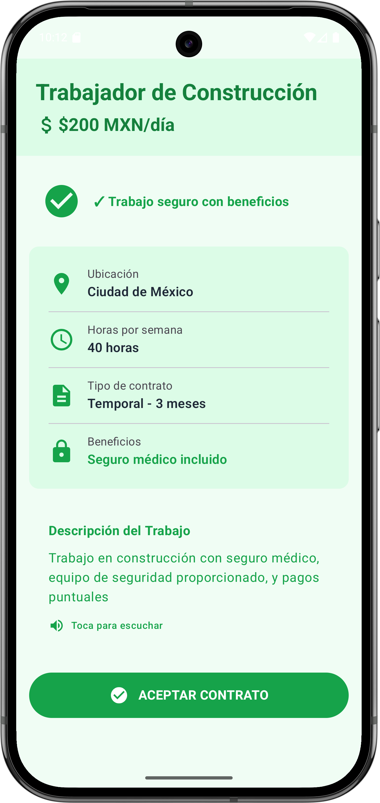
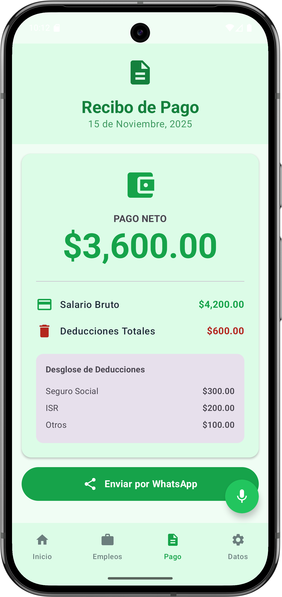
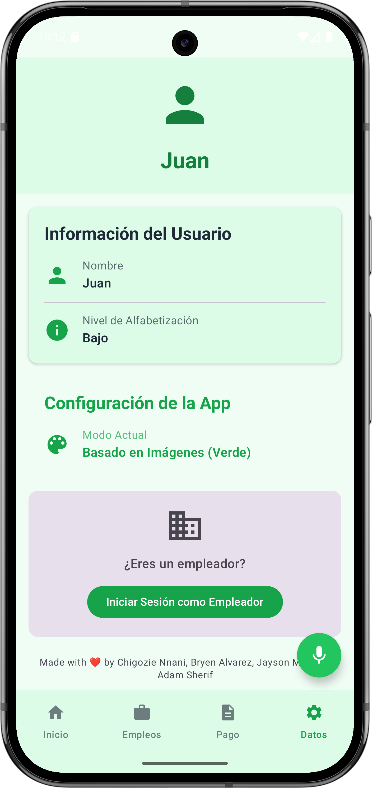
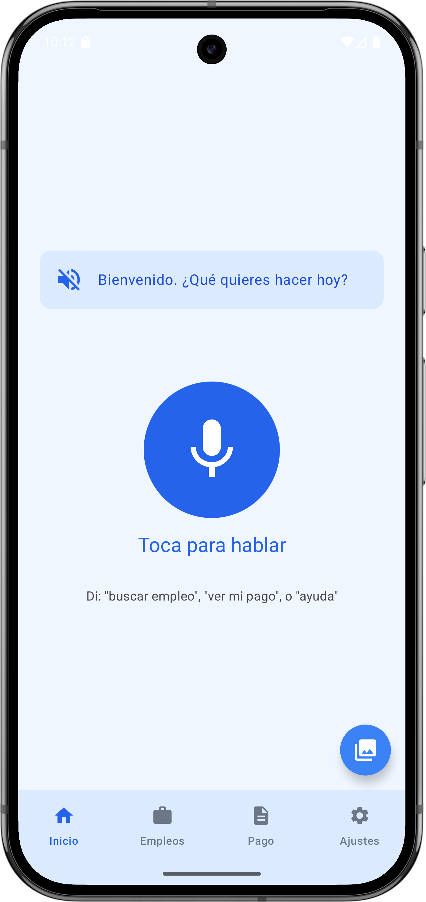
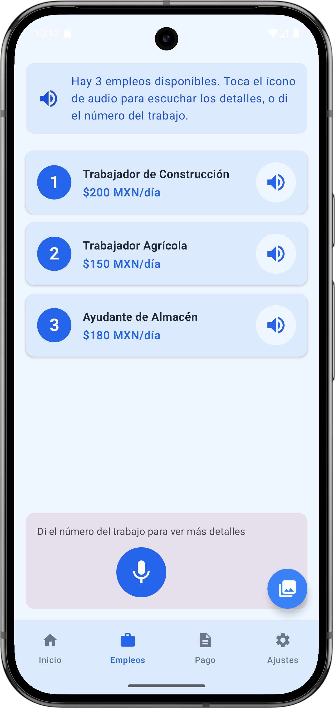
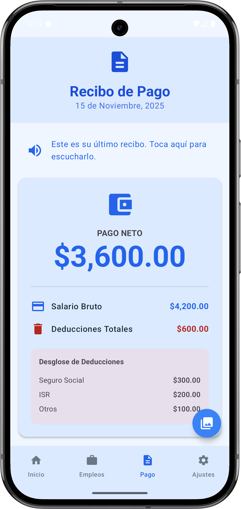
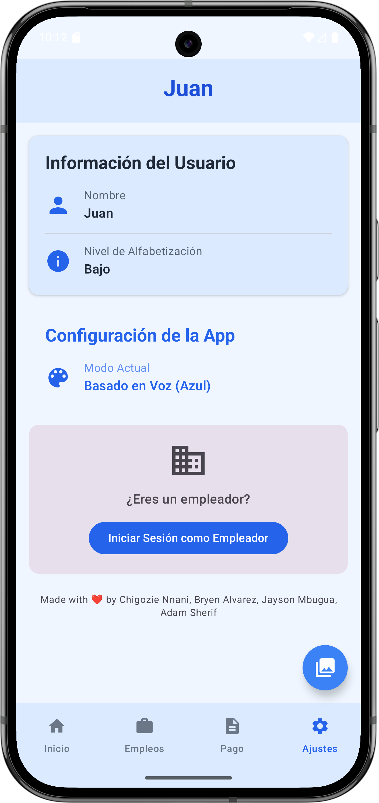

# Mexico Migrant Worker Usability Study Kotlin App

## Overview
This Android application is designed for a comparative usability study to test two different interface prototypes for low-literacy migrant workers in Mexico. The app allows users to complete critical tasks related to job searching, payment review, and contract acceptance while accurately logging usability metrics.

## Technical Specifications
- **Platform**: Android Native (Kotlin)
- **Target SDK**: 36 (exceeds requirement of 34+)
- **Minimum SDK**: 24
- **Architecture**: Single-Activity with Jetpack Compose UI
- **Data**: Hardcoded mock data (offline-first, no external APIs)
- **Navigation**: Navigation Compose with smart context preservation
- **Audio**: Android `TextToSpeech` and `SpeechRecognizer` APIs

## Features

### Prototype A: Speech-Based Interface (Blue Theme)
**Color**: Blue (#2563EB - Blue 600)  
**Interaction Model**: Voice-first interaction with real-time audio feedback and command recognition.

#### Screens:
1. **Speech Home Screen**
   - Large microphone button for voice interaction
   - Voice prompt: "Bienvenido... ¿Qué quieres hacer hoy?"
   - Real voice command recognition for navigation ("buscar empleo", "ver mi pago", etc.)
   - Clean, minimal UI focused on audio cues

2. **Speech Job List Screen**
   - Three job listings with minimal text
   - Audio playback icons for full job descriptions (Text-to-Speech)
   - Voice-based job selection (e.g., saying "uno", "dos" opens the corresponding job)
   - Large numbered badges for easy voice referencing

3. **Receipt Screen (Blue Mode)**
   - Clickable audio instruction card that reads full receipt details via TTS
   - Large, clear display of net pay and deductions
   - Optimized for listening rather than reading

### Prototype B: Image-Based Interface (Green Theme)
**Color**: Green (#16A34A - Green 600)  
**Interaction Model**: Icon-driven navigation with visual safety indicators.

#### Screens:
1. **Image Home Screen**
   - 2x2 grid of large, icon-driven buttons
   - Icons: Briefcase, Wallet, Checkmark, User
   - High-contrast, touchable cards
   - Clear visual hierarchy

2. **Image Job List Screen**
   - Visual safety indicators with color coding:
     - **Green with Checkmark**: Safe job with benefits
     - **Red with Warning Icon**: Job without benefits/unsafe conditions
   - Large, distinct cards with prominent icons
   - "ACEPTAR CONTRATO" buttons on each card
   - Visual legend for safety indicators

3. **Receipt Screen (Green Mode)**
   - Same layout with green color theme
   - "Enviar por WhatsApp" button for sharing
   - Icon-rich presentation of payment details

### Shared Screens
1. **Job Detail Screen**
   - Comprehensive job information
   - Safety indicators
   - **Audio Feature**: Clicking the description card reads the full text aloud (TTS)
   - Contract acceptance functionality
   - Works with both prototypes (adapts to current theme)

2. **Settings Screen**
   - User profile display
   - Current mode indicator
   - Usability metrics viewer
   - Team credits footer

### Smart Mode Switching
- **Floating Action Button (FAB)**: Always visible in bottom-right corner.
- **Context Preservation**: Switching modes intelligently preserves your navigation state. 
  - If you are viewing the *Job List* in Image mode and switch to Speech mode, you remain on the *Job List* (now in Speech mode).
  - Navigation stack is managed to prevent deep history loops.

## Mock Data

### User Profile
- **Name**: Juan
- **Literacy Level**: Bajo (Low)

### Jobs (3 Available)
1. **Trabajador de Construcción**
   - Pay: $200 MXN/día
   - Location: Ciudad de México
   - Benefits: ✓ Yes
   - Safe: ✓ Yes
   - Hours: 40/week
   - Contract: Temporary - 3 months

2. **Trabajador Agrícola**
   - Pay: $150 MXN/día
   - Location: Sinaloa
   - Benefits: ✗ No
   - Safe: ✗ No
   - Hours: 60+/week
   - Contract: Temporary - Seasonal

3. **Ayudante de Almacén**
   - Pay: $180 MXN/día
   - Location: Monterrey
   - Benefits: ✓ Yes
   - Safe: ✓ Yes
   - Hours: 48/week
   - Contract: Permanent

## Team Credits
Made with ❤️ by:
- Chigozie Nnani
- Bryen Alvarez
- Jayson Mbugua
- Adam Sherif

## Screenshots

<p align="center">
  
  
  
</p>
<p align="center">
  
  
  
</p>
<p align="center">
  
  
  
</p>

## Running the Application

### Prerequisites
- Android Studio Hedgehog or later
- JDK 11 or later
- Android SDK 34+
- A device/emulator with microphone support (for Speech features)

### Build and Run
1. Open project in Android Studio.
2. Sync Gradle files.
3. Select a device/emulator (API 24+).
4. Click Run.

*Note: For the best experience with Voice Commands, ensure your emulator or device has microphone permissions enabled and audio output active.*

## Code Structure

```
app/src/main/java/com/example/mexico_proj/
│
├── MainActivity.kt                 # Main entry point with smart navigation
├── AppModels.kt                    # Data models and mock data
├── AppState.kt                     # Global state management
├── TextToSpeechManager.kt          # TTS implementation
├── SpeechRecognizerManager.kt      # Voice recognition implementation
├── UsabilityLogger.kt              # Logging system
│
├── ui/
│   ├── components/
│   │   ├── AppBottomBar.kt        # Adaptive bottom navigation
│   │   └── BottomTab.kt           # Tab data class
│   │
│   ├── screens/
│   │   ├── SpeechHomeScreen.kt    # Prototype A home (Voice)
│   │   ├── SpeechJobListScreen.kt # Prototype A job list (Voice)
│   │   ├── ImageHomeScreen.kt     # Prototype B home (Touch)
│   │   ├── ImageJobListScreen.kt  # Prototype B job list (Touch)
│   │   ├── ReceiptScreen.kt       # Shared receipt (adaptive + audio)
│   │   ├── JobDetailScreen.kt     # Shared job detail (adaptive + audio)
│   │   └── SettingsScreen.kt      # User profile & metrics
│   │
│   └── theme/
│       ├── Color.kt               # Color definitions
│       ├── Theme.kt               # Theme switching logic
│       └── Type.kt                # Typography
```

## License
This is a research project for usability studies. All rights reserved.
